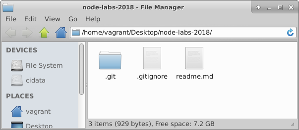

# Github
The repository you've created so far is just on your computer, which is handy, but makes it pretty hard to share and work with others on.

### Create a GitHub Account
GitHub is a website that allows people everywhere to upload what they're working on with Git and to easily work together.

Visit [github.com](http://github.com) and sign up for a free account.

### Add username to Git

Add your GitHub username to your Git configuration, which will be needed in order to verify the upcoming challenges. Save it exactly as you created it on GitHub — capitalise where capitalised, and remember you don't need to enter the "<" and ">" .

Add your GitHub username to your configuration:

~~~bash
$ git config --global user.username <YOUR_GITHUB_USERNAME>
~~~

## Remote Repository
When you put something on GitHub, that copy lives on one of GitHub's servers. This makes it a remote repository because it is not on your computer, but on a server, "remote" and somewhere else. By pushing your local (on your computer) changes to it, you keep it up to date.

Others can always get the latest from your project by pulling your changes down from the remote (and onto their computer). This is how everyone can work on a project together without needing access to your computer where your local copy is stored.

### Create a Remote Repository

You want to sync your local version with one stored on GitHub.com called the remote version. So first create an empty remote repository on GitHub.com.

Go to github.com, log in, and click the '+' in the top right to create a new repository.
Give it a name that matches your local repository's name, ***node-labs-2018***, and a short description.
Select the following options:
- make it public
- *don't* create a readme.md (you have one already in your local repo).
- create a .gitignore and select the *Node* option in the dropdown.
Click create repository and you should be taken to your new repo page. 
- Copy the URL from the browser address bar.  You will need the URL of the repo to connect your local repo to this "remote" repo.

### Connect your Local to your Remote

Now you've got a remote repository on GitHub.com, back in your terminal, and inside of the 'node-labs-2018' folder that you initialised as a Git repository, you want to tell Git the location of the remote version on GitHub's servers. You can have multiple remotes so each requires a name. For your main one, this is commonly named *origin*.

~~~bash
$ git remote add origin <Ugit RLFROMGITHUB>
~~~

Your local repository now knows where your remote one named 'origin' lives on GitHub's servers. T

>    A note:
>    
>    If you have GitHub for Windows on your computer, a remote named 'origin' is automatically created. In that case, you'll just need to tell it what URL to associate with origin. Use this command instead of the 'add' one above:
>    
>    $ git remote set-url origin <URLFROMGITHUB>

### Pull down the changes on the remote repo
You created a .gitignore file on the remote repo. You need to *pull* this change into your local repo. Git has a branching system so that you can work on different parts of a project at different times but by default the first branch is named 'master'. When you pull (and push) from a project, you tell Git the branch name you want and the name of the remote that it lives on.
- Enter the following command to pull the remote changes into the master branch on your local repo:
~~~bash
$ git pull origin master
~~~ 
- You will be required to edit a change file to justify the committing of remote changes to your local repo. Enter some text to describe the change and save the file.
Now we will *push* your local work (i.e. the readme.md) to the remote repo. 

### Push Work to your Remote

Next you want to push (send) everything you've done locally to GitHub. Ideally you want to stay in sync, meaning your local and remote versions match.

Similar to a pull, when you push from a project you tell Git the branch name you want to push and the name of the remote that it lives on.

In this case, we'll send our branch named 'master' to our remote on GitHub named 'origin'.

~~~bash
$ git push origin master
~~~

Now go to GitHub and refresh the page of your repository. Everything is the same locally and remotely. You should see the following in your local repo:

Congrats on your first public repository! You will use this repository to contain the rest of your lab work.
