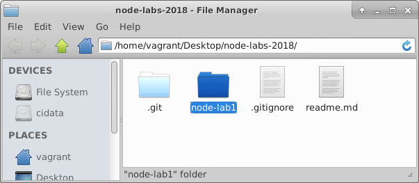
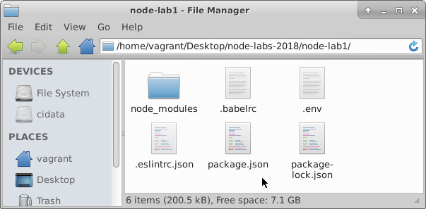

# Set Up and Configuration
We will now set up and configure a development environment for Node.js.

#### package.json
If you're developing a Node program or library for deployment, it's a good practice to include a **package.json** file. This file is a manifest of the Node project and is located at your project root. It contains various information specific to your project.

- Create a new folder called *node_lab1* in your new repo.

- Open a terminal window in *node_lab1* and enter the following command:

> ~~~bash
npm init
~~~

You will be prompted for details.

- Enter the following:

> ~~~json
name: (lab1) node-lab1
version: (1.0.0) 
description: node lab 1
entry point: (index.js)
test command:
git repository: 
keywords:
author: YOUR_GIT_USERNAME
license: (ISC)
~~~

You should now see a ``package.json`` file in the lab folder with these details.

#### Babel

We will be writing our Javascript using ES2015 so we require transcoding before our Node app runs. We need to bring in some babel packages to handle this.

- Enter the following command to get the relevant babel package and relevant  presets.
~~~bash
npm install --save-dev babel-cli
npm install --save-dev babel-preset-env
~~~

The ``--save-dev`` will write this dependency to the development section of the package.json.

- To configure babel to transcode from es2015, create a file called **.babelrc** in the **node-lab1** folder and enter in the following:
~~~json
{
  "presets": ["env"]
}
~~~
Now have a look at the  *package.json* file. You'll see that the babel development dependencies are specified.  

#### Express
To create a web server, we're going to use **Express.js** so we need to install this as a **normal dependency**.

- Install the express package.
~~~bash
npm install --save express
~~~

The --save flag will write this dependency to package.json.

#### Nodemon
When we change things in a Node.js project, a restart is required for the changes to be reflected in the running process. This can be very time consuming. Instead of manually restarting Node, we will install the ``nodemon`` package as a **development dependency**, which can monitor our files and auto-restart Node for us when we save changes to disk.

- Install Nodemon:
~~~bash
npm install --save-dev nodemon
~~~

####Startup Script
We want to specify a script to start up the Node server, which will be the **server.js** file. So our start script would be ``node server.js``. However, since we want the code to be transcoded using  babel and started with nodemon, we will add a **nodemon** execution wrapper and use **babel-node** instead of the node command.

- Modify the package.json file and replace the *scripts* property with the following:
~~~json
....
"scripts": {
    "start": "nodemon --exec babel-node index.js"
  },
....
~~~

#### Linting
Finally, it'd be nice to get feedback on the quality of your Javascript code as you write it. ESLint is a tool for identifying and reporting on patterns found in ECMAScript/JavaScript code. It kind of tells you if your code looks lousy! 

- Install ESLint as follows:
~~~bash
npm install --save-dev eslint babel-eslint
~~~

- To configure ESLint, enter the following at the command line:
~~~bash
./node_modules/.bin/eslint --init
~~~

- Answer the resulting questions as follows:

> How would you like to configure ESLint? Use a popular style guide

> Which style guide do you want to follow? Google

> What format do you want your config file to be in? JSON

You should now see a file called *.eslintrc.json* in the *node-lab1* folder.

- Open *.eslintrc.json* and replace the contents with the following
~~~json
{
    "extends": "google",
    "parserOptions": {
        "ecmaVersion": 6,
        "sourceType": "module"
    },
    "env": {
        "node": true
    }
}
~~~
This specifies that we wish to lint ES6 Javascript in module format (uses imports and exports). We also specify the environment is Node.js with associated global variables and Node.js scoping. 
You've now set your project folder up for linting your Javascript files.

#### App Config
As discussed in class, one of the advantages of NPM is the wide availability of handy utility packages that follow accepted best practice. App configuration management and environment variables are common to many apps. When using public, cloud based repos you should use best practice approaches to keep sensitive parameters such as private keys and passwords safe.  

Dotenv is a zero-dependency module that loads environment variables from a .env file into *process.env*. In doing this Dotenv stores configuration in the environment separate from code is based on "The Twelve-Factor App" methodology.
This simple application just needs some typical configuration details, for example the port and host info.

- Install Dotenv as a normal, runtime dependency
~~~bash
npm install dotenv --save
~~~

- Create a new file in your application root folder called **.env** and add the following content:
~~~javascript
NODE_ENV=development
PORT=8080
HOST=localhost
~~~

As you could be putting sensitive stuff in the .env file, you should NOT commit your .env file to version control. It should only include environment-specific values such as database passwords or API keys used by your server-side API. Also, your production database should have a different password than your development database.

To ensure this is the case, do the following:

- Open *.gitignore* file in you *node-labs-2018* folder. Check that it contains the following entry:
~~~json
# dotenv environment variables file
.env
~~~

#### Commit it
Your *node-lab1* folder should look like this:

Now that we have a our basic setup and configuration complete,this is a good time to commit your changes to git.

- As in previous labs, change directory to the *node_labs_2018* folder and do the following:
~~~bash
git add -A
git commit -m "set up and initial configuration"
~~~

You should **NOT** see any output indicating changes ignored file and folders, for example the *node_modules* folder or *.env*.We do not need to track changes here as it's contents are specified in the *package.json*.
