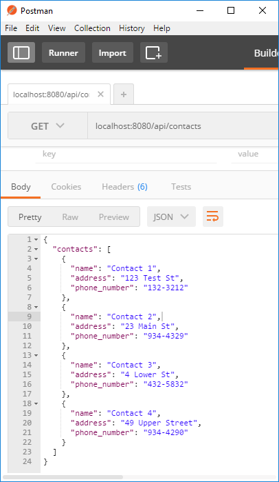

# Express Applications

We'll now add some static content to our web server. Up to now you've used **http-server** which is fine for prototyping HTML. We'll now move to Express, the package we installed in the last section. Express is a richer web app package and provides a nice high level approach to serving up static content. It's based around the idea of creating an Express "app" that you can easily configure. One of the configuration options allows you to specify the location of your publicly available content such as static HTML, CSS, client-side Javascript files etc.

- In your *node-lab-1* folder, create the following folder structure:
~~~
+public
    |-javascript
    |-stylesheets
~~~
- Get the solution to the [*html/css lab*](./files/static.zip) and place the files directly into the *public* folder(the *index.hmtl* file should in the *public* folder).
- In node-lab-1, replace the contents of **index.js** with the following javascript:

~~~javascript

import dotenv from 'dotenv';
import express from 'express';

dotenv.config();

const server = express();

const port = process.env.PORT;

server.use(express.static('public'));

server.listen(port, () => {
  console.info(`Server running at ${port}`);
});

~~~

- Now test the application as before in a browser. It should display the default resource (index.html) from the public folder.

#### Simple Routing using Express
Express gives us an easy way of mapping specific URL paths to Javascript functions. You will now replicate the functionality from the "Hello World" section so that a HTTP GET request for the URL path  '/greeting/' will respond with "Hello World". Modify the index.js by adding an ``app.get([route],[callback function])``.
- Modify the index.js script to include a route for /greeting that responds with "hello world".

~~~javascript
import dotenv from 'dotenv';
import express from 'express';
import greeting from './greeting';

dotenv.config();

const app = express();

const port = process.env.PORT;

app.use(express.static('public'));

// add route for /greeting
app.get('/greeting', (req, res)=>{
  let lang = req.headers['accept-language'];
  const defaultLang='en';
  if (!greeting[lang]) lang=defaultLang;
  const response={
    lang: lang,
    message: greeting[lang],
  };

  res.writeHead(200, {'Content-Type': 'text/plain',
                      'Content-Language': response.lang});
  res.end(response.message);
});

app.listen(port, () => {
  console.info(`Server running at ${port}`);
});
~~~
###Commit and Push to Github
Commit your changes using git as before and push your changes to your remote repository.

~~~script
git add -A
git commit -m "Changed to express app"
git push origin master
~~~

### Contacts API

 Ultimately we would like our API to use a datav=base such as Mongo and allow for a more realistic API that can cope with large volumes of data you would expect in a production environment.

Create a new folder called **api** in **node-lab-1**. Create another folder called **contacts** in **api**. Your folder structure should look as follows:

~~~
+node-lab-1
    |-api
       |-contacts
~~~

We will use test data for the time being. 

- Create a new file called **contacts.js** in the contacts folder and add the following code:

~~~javascript
export const contacts = [
  {
    'name': 'Contact 1',
    'address': '123 Test St',
    'phone_number': '132-3212',
  },
  {
    'name': 'Contact 2',
    'address': '23 Main St',
    'phone_number': '934-4329',
  },
  {
    'name': 'Contact 3',
    'address': '4 Lower St',
    'phone_number': '432-5832',
  },
  {
    'name': 'Contact 4',
    'address': '49 Upper Street',
    'phone_number': '934-4290',
  },
];
~~~

- Also in the contacts folder, create a new file called **index.js** and enter the folowing javascript:

~~~javascript
import express from 'express';
import {contacts} from './contacts';

const router = express.Router(); // eslint-disable-line
router.get('/', (req, res) => {
  res.send({contacts: contacts});
});

export default router;
~~~

- Now update **index.js** to use the new contacts routing script by replacing the contents with the following code

~~~javascript
import dotenv from 'dotenv';
import express from 'express';
import contactsRouter from './api/contacts';

dotenv.config();

const app = express();

const port = process.env.PORT;

app.use(express.static('public'));

app.use('/api/contacts', contactsRouter);
app.use(express.static('public'));

app.listen(port, () => {
  console.info(`Server running at ${port}`);
});
~~~

Now test the application again by doing a HTTP GET on localhost/api/contacts. You should see something simlilar toe the following:

### Challange
- Try to include in server-side route for the Hacker News lab you did last week. Follow the same procedure as above.

> hint: create a new folder in api for Hacker News. Create a routing script and update index.js to add the Hacker News route.
