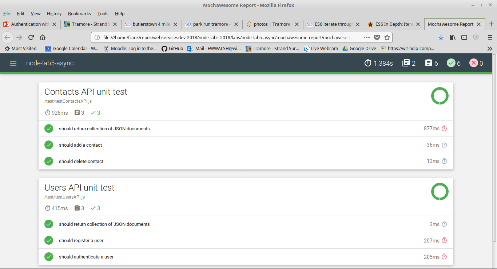

# Test the User API

We should now construct some tests to check the user API is working as designed.
+ create a new file **/test/testUsersAPI.js** and enter the following tests:

~~~javascript
import supertest from 'supertest';
import {app} from './../index.js';
import should from 'should'; // eslint-disable-line
// UNIT test begin
describe('Users API unit test', function() {
  this.timeout(120000); // eslint-disable-line
  // #1 return a collection of json documents
  it('should return collection of JSON documents', function(done) {
    // calling home page api
    supertest(app)
    .get('/api/users')
    .expect('Content-type', /json/)
    .expect(200) // This is the HTTP response
    .end(function(err, res) {
        // HTTP status should be 200
        res.status.should.equal(200);
        done();
    });
  });

  // #2 add a user
  it('should register a user', function(done) {
    // post to /api/contacts
    supertest(app)
    .post('/api/users')
    .query({action: 'register'})
    .send({username: 'Contact 99', password: 'test1'})
    .expect('Content-type', /json/)
    .expect(201)
    .end(function(err, res) {
      res.status.should.equal(201);
      res.body.success.should.equal(true);
      done();
    });
  });

  // #3 login a user
  it('should authenticate a user', function(done) {
    // post to /api/contacts
    supertest(app)
    .post('/api/users')
    .send({username: 'user1', password: 'test1'})
    .expect('Content-type', /json/)
    .expect(201)
    .end(function(err, res) {
      res.status.should.equal(200);
      res.body.token.substring(0, 3).should.equal('JWT');
      done();
    });
  });
});
~~~

+ Run the tests by entering ~~~npm test~~~ in the terminal window. All going well,you should see results as follows:

+ Notice that the time for registering and authentication is relatively high - this is probably due to the jwt and bcrypt algorithms.

+ **CHALLENGE**: write a test to check a failed authentication attempt (e.g. incorrect password) 
