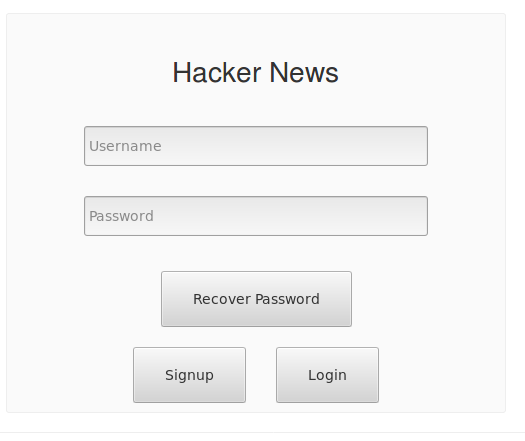

# Create a Login/Signin page

Rather  than developing our own login page, lets get a third party component. #

+ Include  the following React Login Component in the Hackernews Project:

~~~bash
npm install --save react-signup-login-component
~~~

+ In hackerNews/src folder, create a new file called **loginPage.js** with the following contents:

~~~Javascript
import React from 'react';
import ReactSignupLoginComponent from 'react-signup-login-component';
import * as api from './api';
import Auth from './auth';
import { browserHistory } from 'react-router';

const LoginPage = (props) => {
    const signupWasClickedCallback = async (data) => {
      try{
      if (data.password!==data.passwordConfirmation) Error('Passwords do not match!');
        await api.signup(data.username, data.password);
        browserHistory.push('/');
      }catch (e){
         alert(`Signup Failed ${e}` )
      }
    };
const loginWasClickedCallback = async function(data) {
    try{
     const result = await api.login(data.username, data.password);
     Auth.authenticateUser(result.token);
     browserHistory.push('/');

   }catch (e){
       alert(`SAuthentication Failed: ${e}` )
   }

    };

    return (
        

            <ReactSignupLoginComponent
                title="Hacker News"
                handleSignup={signupWasClickedCallback}
                handleLogin={loginWasClickedCallback}
            />
        

    );
};

export default LoginPage;
~~~
Again we import the *api.js* script to interact with the users api. We also use the *auth.js* script to manage local storage of the JWT token.

## Add the loginPage to HackerNews App
We will now update the HackerNews app such that, if the user has not authenticated, we will present a link (in the form of a button) to the loginpage.

+ Open hackernews/src/index.js and add a new route for the login page.

~~~Javascript
import LoginView from './loginPage';

...

ReactDOM.render(
 (
  <Router history={browserHistory} >
    <Route path="/" component={App}>
       <IndexRoute component={HackerApp}/>
       <Route path="posts/:postId" component={CommentView} />
       <Route path="login" component={LoginView} />
    </Route>
  </Router>
),
  document.getElementById('root')
);  
~~~

+ Make sure that *react-bootstrap* is installed in your app:  

~~~bash
npm install --save react-bootstrap
~~~

+ Open *hackerNews/src/App.js* and add a new "Login/Signin" button.

~~~Javascript
import {Button} from 'react-bootstrap';

~~~

+ Locate the render function in the HackerApp component and replce with the following so that the button is only visible if authentication fails.:

~~~Javascript
render() {
  const posts = _.sortBy(this.state.posts, post =>
        post.upvotes);
  return (
    

    {this.state.isHidden &&  <Button href="/login">Login/Signup</Button>}
    {!this.state.isHidden && <NewsList posts={posts}
          upvoteHandler={this.incrementUpvote} />}
     <Form addHandler={this.addPost} />
   

  );
}
}
~~~

Now test the HackerNews app. If not logged in you should see the following:

Clicking on the "login/signin" button should display the Login page:

Authenicate using username: user1, password: test1. This should return you to the main page and the list of news posts.

 

Congratulations! You've included JWT in your app.

## Challenge

Review your progress so far. Use the same approach to accomplish the following:

+ integrate the API with the comment page.
+ Update the contactList app to use the API developed in this lab.
